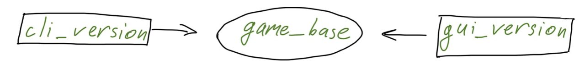
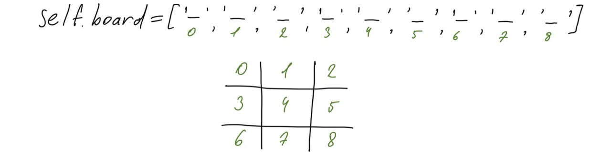

# Tik-tak-toe with AI and two versions of interface
### First year, winter 2020, Programming 1

**Goal**: to make tik-tak-toe with a **graphical** and a **command-line** interface and with an **invincible** artificial intelligence.

# Documentation

## Launching 

The game is launched via the **main.py** file. 
If the **CLI** version is selected, the game starts on the command line. If the **GUI** version is selected, the game starts in a separate window (you must have the [PyGame](https://www.pygame.org/wiki/GettingStarted) library installed)

## Modes

The game supports **two** modes: 
1. Against artificial intelligence
2. Against man

## Main logic

The logic of the game is built in this way:
1. The player chooses where to play (**GUI** / **CLI**)
2. The player chooses the mode (**PvP** / **PvC**)
3. The game takes place
4. The winner is displayed
5. The player is given the choice to start over

## Program structure

The program is divided into three parts. The **gui_version** and **cli_version** parts work with the independent **game_base** part. **Game_base** contains the **Board** class and the **Player** class, which are responsible for representation and operations with the game field and artificial intelligence, respectively

## game_base
Contains two files with the **Board** and **Player** classes. 

#### `class Board` 
The Board class is responsible for operations with the playing field. The field itself is represented as an attribute `self.board`, which contains an array of length 9.

#### `class Player`
The player class is responsible for the AI. For the algorithm to work, minimax contains three attributes `self.human`, which displays whether a person or AI is playing. `self.player_char`, which displays which character the player is playing, and `self.player_opposite_char`, which displays the opponent's character

## cli_version
Contains two files with the **CLI** and **Game** classes

#### `class CLI` 
The CLI class is responsible for drawing the game field, the main menu, displaying the outcome of the game, and offering to start a new game
#### `class Game` 
The game class is fully responsible for the game logic. It contains the game cycle, the function of selecting the game mode and selecting the player's move. The attribute `self.actual_player` displays the player who is currently playing.

## gui_version
Сontains two files with the **GUI** and **Game** classes. A file with constants and a folder with music

#### `class GUI` 
The Gui class works with PyGame and deals with drawing in the window and tracking player clicks. Also engaged in the musical design of the game
#### `class Game` 
The game class is fully responsible for the game logic. It contains the game cycle, the function of selecting the game mode and selecting the player's move. The attribute `self.actual_player` displays the player who is currently playing. Attribute `self.actual_player` displays whether the game is over or not `self.actual_player`

## AI Algorithm 

To create an invincible AI, I used the **minimax** algorithm.
The main idea is that we give the computer the opportunity to make a move, then we simulate the move of the opposite side and so on until we come to a win, loss or draw. 

### Best visual representation of the algorithm principle:

In my algorithm, I used **1** as a display of the computer's victory, **-1** as a display of the player's victory, and **0** for a draw. Each field is filled with the sign of the player who moves and the position is evaluated. After the position has been evaluated, the computer selects the best position and makes a move

Due to the fact that the field for playing tic-tac-toe is small, we can calculate all possible outcomes, unlike chess, in which you need to limit the depth of calculation

## Alternative solutions

To speed up the algorithm, you can add **Alpha–beta** pruning to it. 
Due to the small field, the speed of calculating the position of artificial intelligence does not affect much, but it can be accelerated by applying **Alpha-beta** pruning, which will reduce the calculation time by several times

## Course of work

To start working on the project, it was necessary to have a good understanding of the concept of classes for creating games, as well as to familiarize yourself with the PyGame library. To learn this, I used several books, youtube, and of course materials from the lessons.
it was also necessary to study the minimax algorithm, which ensures the operation of AI. Youtube and several articles helped.
With this knowledge, the work went smoothly, of course, sometimes you needed to Google something or see how something is implemented in other programs :)

Literature that I used:
  1. Al Sweig "Invent Your Own Computer Games with Python"
  2. Dan Bader "Pure Python. Subtleties programming for pros" (A little bit) 